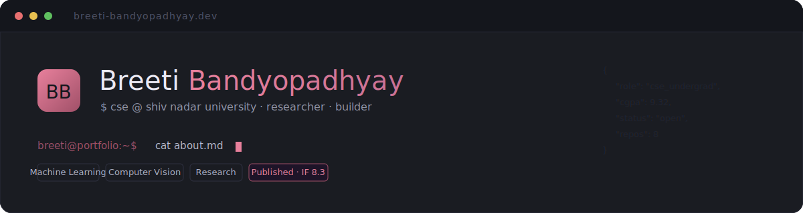

<!-- banner -->
<p align="center">
  
</p>

<p align="center">
  <a href="https://silvermysti.github.io"></a>
  
  
  
</p>

```bash
$ breeti --portfolio
> a code-editor themed personal site · dark + light · zero dependencies
```

---

### `// about`

A personal portfolio website with a **code-editor aesthetic**, built as a single
self-contained HTML file. Sidebar file tree, openable tabs, a content pane — and a
one-click toggle between a dark *Slate & Blush* theme and a light *Warm Paper* theme.

> Designed to read like a resume at a glance, then open into full detail on click.

---

### `// features`

| | |
|---|---|
| 🗂 **Code-editor UI** | Sidebar nav, tabbed content pane, file-style section names |
| 🎨 **Two themes** | Dark `Slate & Blush` · Light `Warm Paper`, toggled instantly |
| 📄 **Resume overview** | `about.md` summarises every section; click to open the full tab |
| 📱 **Fully responsive** | Fluid `clamp()` type · tablet icon rail · mobile bottom-nav |
| 🪶 **Zero dependencies** | Inline SVG icons, one `.html` file, no build step |

---

### `// sections`

```
about    experience    research    projects
skills    honours       education   organisations
```

---

### `// built with`

```json
{
  "markup":  "HTML",
  "styles":  "CSS custom properties + clamp() fluid type",
  "logic":   "vanilla JavaScript",
  "icons":   "inline SVG sprite",
  "fonts":   ["DM Sans", "DM Mono"]
}
```

---

### `// run locally`

```bash
git clone https://github.com/Silvermysti/silvermysti.github.io.git
cd silvermysti.github.io
open index.html        # no build step — just open it
```

---

### `// deploy`

Hosted on **GitHub Pages** — push to `main` on a `<username>.github.io` repo and it
goes live automatically. Works equally well on Netlify, Vercel, or any static host.

---

### `// contact`

```
email      bb916@snu.edu.in
github     github.com/Silvermysti
linkedin   in/breeti-bandyopadhyay
location   Pilani, Rajasthan
```

<sub>$ designed & built by Breeti Bandyopadhyay</sub>
